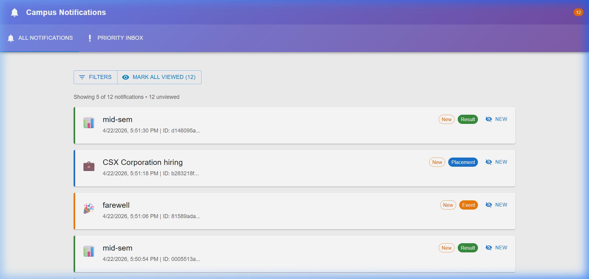
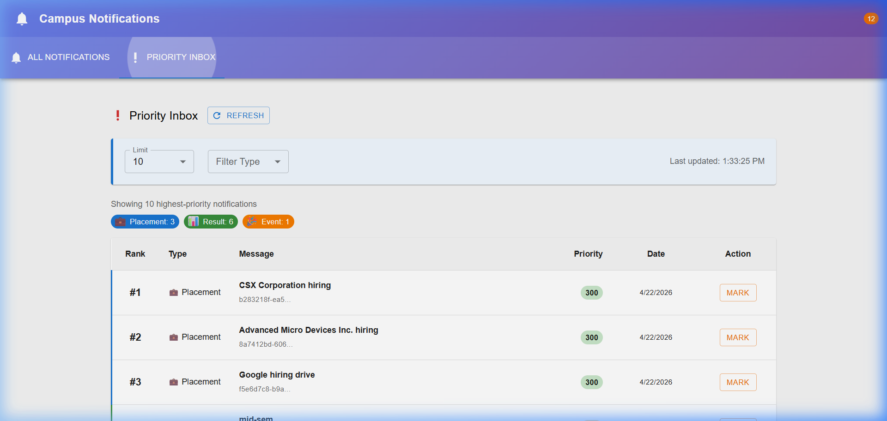
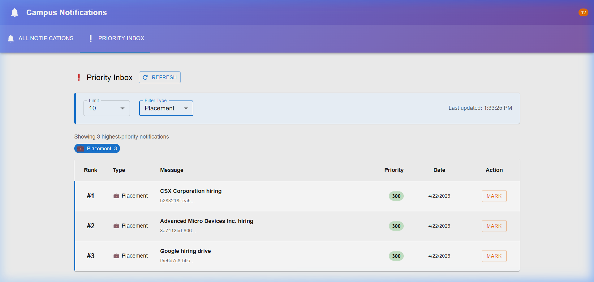

# Campus Evaluation Notification Platform 🚀

A modern, institutional-grade notification system designed for campus evaluations. Students can receive real-time updates regarding Placements, Events, and Results with a sophisticated Priority Inbox for the most critical updates.

## 🌟 Key Features

- **Dual-View Dashboard**: 
    - **All Notifications**: Paginated and filterable view of all campus updates.
    - **Priority Inbox**: Smart ranking system that identifies the top "n" most important unread notifications.
- **Smart Ranking Algorithm**: Priority is determined by a combination of notification type weight (Placement > Result > Event) and time-based recency decay.
- **Real-time Persistence**: Viewed status is tracked and persisted across sessions using `localStorage`.
- **Centralized Logging**: Full-stack logging integration for robust error handling and audit trails.
- **Responsive Design**: Premium UI built with Material UI, optimized for both desktop and mobile devices.

## 🛠️ Tech Stack

- **Frontend**: React 19, Vite, Material UI (MUI).
- **Logic**: Node.js implementation of the Priority Ranking algorithm.
- **Documentation**: Comprehensive architectural design (REST, DB Schema, Scalability).
- **Environment**: Runs exclusively on `http://localhost:3000`.

## 📸 Screenshots

### 1. Main Dashboard (All Notifications)
The dashboard provides a clean interface for scanning all campus updates with visual "NEW" badges and type-coded indicators.



### 2. Priority Inbox (Smart Ranking)
The Priority Inbox uses a weighted decay algorithm to ensure the most important and recent notifications stay at the top.



### 3. Filtered Views
Supports filtering by notification type (Placement, Result, Event) across all views.



## 🚀 Getting Started

### Prerequisites
- Node.js (v18+)
- npm

### Installation
1. Clone the repository:
   ```bash
   git clone https://github.com/kruthikroshan/2303A52339.git
   cd Campus-Evaluation-FS
   ```
2. Install dependencies:
   ```bash
   cd Stage-7-Frontend-App/notification-app-fe
   npm install
   ```

### Running the App
1. Start the React development server:
   ```bash
   cd Stage-7-Frontend-App/notification-app-fe
   npm run dev
   ```
2. Access the application at: **[http://localhost:3000](http://localhost:3000)**

### Running the Priority Demo (CLI)
To see the ranking algorithm in action from the terminal:
```bash
cd Stage-6-Priority-Inbox
node priority-inbox.js
```

## 📄 Documentation
Detailed architectural designs and stage-by-stage implementation notes are available in:
- [System Design (Stage 1-5)](./Stage-1-to-5-System-Design/notification-system-design.md)
- [Submission Summary](./Stage-1-to-5-System-Design/submission_summary.md)

---
**Developed by Godishala Kruthik Roshan**
